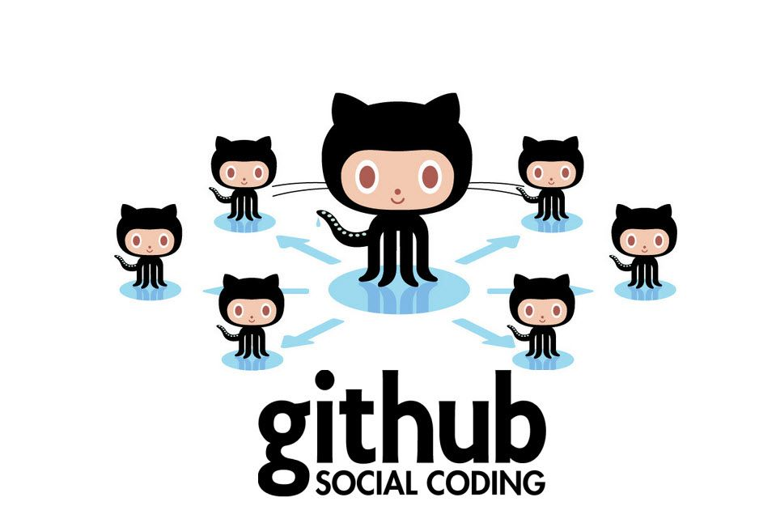

<p align="center">
  
</p>

<p align="center">
  <h2 align="center"> Challenge #2: "Create your GitHub account" (Pre-Release)</h2>
</p>

Now it's time to create a GitHub account. This will open the gate to the big development world.
```$xslt
define your own brand, copywriting, json manipulation, gitlab.
```


* **Author:** Cristofor-io
* **Level:** Beginner
* **Tags:** web, json, getting started, gitLab, Markdown

---

## Create your GitHub account

## Tasks

### 1. Log in to github.com
Open your browser (Google Chrome, Mozilla Firefox, Opera, etc) and in the address bar type in github.com, then hit ENTER. You will be presented with a similar window as below.  

<p align="center">
  
</p>

Chose a **username** (this needs to be unique), enter your email address and chose a password. Make sure to carefully read the requirements for the password, below the password field. Click the **Sign up for GitHub** button

<p align="center">
  
</p>

The **Welcome to GitHub** window will show up. Click **Continue** button.

<p align="center">
  
</p>

Now you can tailor your experience or skip this step. If you decide to customize your experience, select the options that applies to you, and click **Submit** button. 

<p align="center">
  
</p>

Last step is to confirm your account. You should get a confirmation email in your gmail mailbox. Go to your inbox, open up the email with the subject **GitHub - Please verify your email address.** Click **Verify email address** to confirm your account. 

<p align="center">
  
</p>

Congrats, you just created your GitHub account!
Are you ready to level up? [Let's go!](../challenge3)
